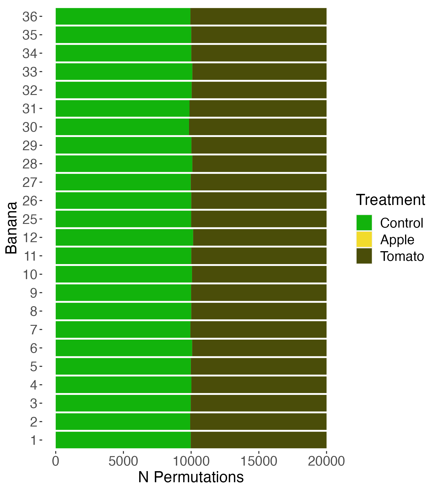

---
output:
  pdf_document: default
  html_document: default
---

```{r setup, include=FALSE}
knitr::opts_chunk$set(echo = TRUE)
```

## Permutation Test

```{r permutation_test, echo=FALSE}
set.seed(30001)

#setwd(dirname(rstudioapi::getActiveDocumentContext()$path))

outcome_brown <- read.csv("../processed_results/aggregated_measurements_black.csv")
outcome_rgb <- read.csv("../processed_results/aggregated_measurements_rgb.csv")
outcome_squish <- read.csv("../processed_results/squish.csv")

obs <- data.frame(
  trt = rep(c("C", "A", "T"), each = 12),
  avg_rgb = outcome_rgb$avg_rgb_day_5 - outcome_rgb$avg_rgb_day_1,
  pct_brown = outcome_brown$pct_brown_day_5 - outcome_brown$pct_brown_day_1,
  pct_squished = outcome_squish$squish
)

obs_t <- obs[c(1:12, 25:36), ]
obs_a <- obs[1:24, ]

n_ctrl_bananas <- n_tomato_bananas <- n_apple_bananas <- 12
n_bananas <- sum(c(n_ctrl_bananas, n_tomato_bananas, n_apple_bananas))
# obs <- data.frame(
#  "banana" = seq_len(n_bananas),
#  "trt" = rep(c("C", "A", "T"), each = n_bananas / 3),
#  "avg_rgb" = rnorm(n_bananas),
#  "pct_brown" = runif(n_bananas),
#  "pct_squished" = runif(n_bananas)
#)
outcome_colnames <- c("avg_rgb", "pct_brown", "pct_squished")

n_permutations <- choose(n_bananas, n_ctrl_bananas) * 
  choose(n_bananas - n_ctrl_bananas, n_apple_bananas)
n_test_permutations <- 20000

test_data <- data.frame(
  "permutation" = seq_len(n_test_permutations),
  "avg_rgb_tomato" = rnorm(n_test_permutations),
  "avg_rgb_apple" = rnorm(n_test_permutations),
  "pct_brown_tomato" = rbeta(n_test_permutations, 1, 1),
  "pct_brown_apple" = rbeta(n_test_permutations, 1, 1),
  "pct_squished_tomato" = rbeta(n_test_permutations, 1, 1),
  "pct_squished_apple" = rbeta(n_test_permutations, 1, 1)
)

# Josh's code of generating permutations
assignments <- c(
  rep("C", n_ctrl_bananas), 
  rep("T", n_tomato_bananas)
)
permutations_t <- data.frame(
  t(mapply(function(x) sample(assignments), seq_len(n_test_permutations))),
  row.names = NULL
)
colnames(permutations_t) <- paste0(
  "banana_", c(seq(n_ctrl_bananas), 
               seq(n_ctrl_bananas + n_apple_bananas + 1, n_bananas))) 

assignments <- c(
  rep("C", n_ctrl_bananas), 
  rep("A", n_apple_bananas)
)
permutations_a <- data.frame(
  t(mapply(function(x) sample(assignments), seq_len(n_test_permutations))),
  row.names = NULL
)
colnames(permutations_a) <- paste0("banana_", seq_len(n_ctrl_bananas + n_apple_bananas)) 


# find the test statistic (difference-in-means) for all test permutations
for (i in 1:n_test_permutations){
  # compute the difference-in-means
  test_stats_t <- 
    colMeans(obs_t[permutations_t[i, ]=="T", outcome_colnames]) - 
    colMeans(obs_t[permutations_t[i, ]=="C", outcome_colnames])
  test_stats_a <- 
    colMeans(obs_a[permutations_a[i, ]=="A", outcome_colnames]) - 
    colMeans(obs_a[permutations_a[i, ]=="C", outcome_colnames])
  
  test_data[i, "avg_rgb_tomato"] <- test_stats_t["avg_rgb"]
  test_data[i, "pct_brown_tomato"] <- test_stats_t["pct_brown"]
  test_data[i, "pct_squished_tomato"] <- test_stats_t["pct_squished"]
  
  test_data[i, "avg_rgb_apple"] <- test_stats_a["avg_rgb"]
  test_data[i, "pct_brown_apple"] <- test_stats_a["pct_brown"]
  test_data[i, "pct_squished_apple"] <- test_stats_a["pct_squished"]
}

# these lines can be kept, but replace test_data with xinhe's final dataframe
data_to_write1 <- cbind(test_data[,c(1,2,4,6)], permutations_t)
#head(data_to_write1)
write.csv(data_to_write1, "../permutations_tomato.csv", row.names = FALSE)

data_to_write2 <- cbind(test_data[,c(1,3,5,7)], permutations_a)
#head(data_to_write2)
write.csv(data_to_write2, "../permutations_apple.csv", row.names = FALSE)


# p-values
# first compute the difference-in-means
dim_stats_t <- 
  colMeans(obs[obs$trt=="T", outcome_colnames]) - 
  colMeans(obs[obs$trt=="C", outcome_colnames])
dim_stats_a <- 
  colMeans(obs[obs$trt=="A", outcome_colnames]) - 
  colMeans(obs[obs$trt=="C", outcome_colnames])

# then compute the p-values
p1 <- sum(dim_stats_t["avg_rgb"] <= test_data$avg_rgb_tomato) / n_test_permutations
p2 <- sum(dim_stats_a["avg_rgb"] <= test_data$avg_rgb_apple) / n_test_permutations

p3 <- sum(dim_stats_t["pct_brown"] <= test_data$pct_brown_tomato) / n_test_permutations
p4 <- sum(dim_stats_a["pct_brown"] <= test_data$pct_brown_apple) / n_test_permutations

p5 <- sum(dim_stats_t["pct_squished"] <= test_data$pct_squished_tomato) / n_test_permutations
p6 <- sum(dim_stats_a["pct_squished"] <= test_data$pct_squished_apple) / n_test_permutations

p.values <- data.frame("Average R" = c(p1, p2),
                       "Brown Percentage" = c(p3, p4),
                       "Squish Ratro" = c(p5, p6))
rownames(p.values) <- c("tomato", "apple")
#write.csv(p.values, "p-values.csv")
```

Justified by the random allocation of bananas, we performed permutation tests for each of our treatment conditions. 

First, we tested if tomatoes accelerate the ripening process of bananas with the following competing hypotheses:
$$ H_0:\ \text{Tomatoes do not accelerate the ripening process of bananas} $$
verses
$$ H_a:\ \text{Tomatoes accelerate the ripening process of bananas.} $$

For this test, we only used the data of tomato and control groups, randomly permuted the treatment labels for 20,000 times, and used the difference-in-means of tomato verses control as our test statistic. More specifically, we computed the contrast between the mean outcomes under each treatment label for each permutation. Then we compare the observed difference-in-means with the permuted distribution and find out if our observations are unusual under the null hypothesis.

The following plot visualizes the number of times of every banana being labeled control or tomato among the 20,000 permutations. It shows that for each banana, in around half of the permutations they were labeled control and in the other half they were labeled tomato. Thus, the permutation test is solid with respect to the random allocation of treatment labels.

{width=50%}


The story is similar with testing the effect of apples. The competing hypotheses we are interested in are
$$ H_0:\ \text{Apples do not accelerate the ripening process of bananas} $$
verses
$$ H_a:\ \text{Apples accelerate the ripening process of bananas.} $$

We only used the data of apple and control groups. We permuted the treatment labels for 20,000 times and for each permutation, computed the difference-in-means of apple verses control as the test-statistic. The following plot shows that our permutation test has done a good job of randomly assigning the labels and thus is solid. 

{width=50%}


The computed $p$-values are shown in the following table, which we will explain in more detail in the next section.
```{r pvalues, echo=FALSE}
library(knitr)
kable(p.values)
```
